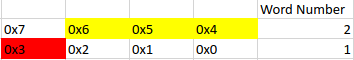
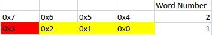

# Corey Personal Statement

Throughout the project I was mainly in charge of implementing the memory as well as the program counter in the single cycled, pipelined and cache version, however I also worked on the assembly programs and wrote some makefile to make running the simulations easier.

## Memory 

The following was all initially implemented in the following commit [Finalised Testing](https://github.com/EIE2-IAC-Labs/iac-riscv-cw-26/commit/f42a9f13187c43600c24fb1266fa717dd6c6bb62) and then fully finalised in the following commit [Added an input signal s for lbu and lb instruction](https://github.com/EIE2-IAC-Labs/iac-riscv-cw-26/commit/d42da76e7e56fe7099b33abaf2848585a7b71e6c)

The Specification for the memory required the instructions `LW, LH, LB, LBU, LHU, SW, SH, SB`. These were all implemented in similar but different ways. The ram itself is byte addressed, I implemented it by splitting the ram array into 0x10FFFF 8 bit blocks.

Firstly when the 32 bit immediate is fed into the ram and split into 4 8 bit blocks this allows for ease of storage and ease of load and read instructions.

ram.sv has 6 inputs and 1 output and they are as follows
```systemverilog
input logic [ADDRESS_LENGTH-1:0] wd,
input logic sw,
input logic sh,
input logic sb,
input logic [ADDRESS_LENGTH-1:0] a,
input logic clk,
output logic [ADDRESS_LENGTH-1:0] rd
```

|input/output|Description|
|---|---|
|wd| The 32 bit data word which will be stored|
|sw| Control Signal for Store Word|
|sh| Control Signal for Store Half|
|sb| Control Signal for Store Byte|
|a| The Address at which the data will be stored|
|rd|The data at address a|

The half_byte_word.sv module is used to read Words, Halfs and Bytes from the rd output of the ram. It has 5 inputs and 1 output and they are as follows.
```systemverilog
input logic lw,
input logic lb,
input logic lh,
input logic s,
input [CPU_WORD-1:0] data,
output [CPU_WORD-1:0] dout
```
|Input/Output|Description|
|---|---|
|lw| Control Signal for load word|
|lb| Control Signal for load byte|
|lh| Control Signal for load half|
|s| Control Signal for signed|
|data| The input data from ram.sv|
|dout| The signed/unsinged Word/Half/Byte|

half_extend and byte_extend both sign and zero extend the half and bytes respectively to 32 bits, either zero extending or sign extending depending on the s input. They both have 2 inputs and 1 output.

half_extend.sv
```systemverilog
input logic [HALF_LEN-1:0] din,
input logic s,
output logic [WORD_LENGTH-1:0] dout
```

byte_extend.sv
```systemverilog
input logic [BYTE_LEN-1:0] din,
input logic s,
output logic [WORD_LENGTH-1:0] dout
```

|Input/output|Description|
|---|---|
|din| byte/half read from the ram|
|s| control signal from decode block for signed/unsigned|
|dout| zero/sign extended byte/half|

top_memory.sv just combines everything and wire things properly.

### Store Instructions

When the instruction requires for data to be stored in the memory it takes in one of 3 control signals SW for store word, SH for store half and SB for store byte. These signals are passed into the following block.

```systemverilog
always_ff @(posedge clk) begin
    if (sb) begin
        ram_array[a] <= d0;
    end
    else if (sh) begin
        ram_array[a] <= d0;
        ram_array[a+1] <= d1;
    end
    else if (sw) begin
        ram_array[a] <= d0;
        ram_array[a+1] <= d1;
        ram_array[a+2] <= d2;
        ram_array[a+3] <= d3;
    end
end
```
Here when SB is high it stores the least significant byte of the 32 bit immediete into the ram array, when SH is high it stores the 2 least significant bytes of the 32 bit immediate into the ram array and when SW is high it loads all 32 bits into the ram array.

The splitting of the input data into 4 8 bit blocks allows for the logic and code within the `always_ff` block to be relatively simple.

The way the code byte addresses the data is to take the 4 8 bit blocks on the 32 bin data input and store each of them relative to each other by storing them based on an offset.

### Load instructions 

Initially the full 32 bit word starting with the least significant byte at the inputted address is loaded into the `half_byte_word.sv` module which takes in the data and control signals and then performs various actions based off of then control inputs.

|Instruction|LW|LH|LB|S|Description|
|---|---|---|---|---|---|
|LW|1|0|0|x [^1]| Here the input word is simply outputted without any formatting|
|LHU|0|1|0|0| Here the 2 least significant bytes are zero extended to 32 bits and outputted|
|LH|0|1|0|1| Here the 2 least significant bytes are sign extended to 32 bits and outputted|
|LBU|0|0|1|0| Here the least significant byte is zero extended to 32 bits and outputted|
|LB|0|0|1|1| Here the least significant byte is sign extended to 32 bits and outputted|

[^1]: The reason the sign input is x on LW is that you cannot have a signed/unsigned word as it is already 32 bits.

### Challenges encountered

The main challenge encountered in this aspect of the memory was the byte addressing as it required alot of fore thought to implement, the way I chose to implement this was by spliting the 32 bit data word into 4 8 bit blocks. This definitely was the right choice as it allowed proper read and load implementations.

Another challenge I encountered was the sign extension however this was easily implemented using a case statement and clever concatination based off of control signals. The case statement was used as it is easier to read and see what is being said.

### Testing Done


## Cache

The following additions and changes to the memory were implemented initially in the following commit  and finalised in the following commit 

There were a few changes to the modules when moving to the cache from the pipelined version. In the cache task I mainly worked on the ram and half_byte_word modules.

ram.sv contains two additionl inputs which are as and removes the original a input.
```Systemverilog
input logic [ADDRESS_LENGTH-1:0] w_a,
input logic [ADDRESS_LENGTH-1:0] r_a,
```
|Input|Description|
|---|---|
|w_a| This is the address where data is written to|
|r_a| This is the address where data is read from|

These additional inputs allow the cpu to read from and write to two different addresses as opposed to always overwriting one.

half_word_byte.sv contains one additional input

```Systemverilog
input logic [1:0] offset,
```
|Input|Description|
|---|---|
|offset| This is the byte off set of the selected byte in the word|


In order to implement the cache I made one large change to the ram, instead of reading the byte at the adress and the bytes at the next 3 addresses as seen below.



Where the cell in red represents is the byte that is addressed in the instruction and the yellow cells represent the additional 3 bytes that are loaded.

I instead changed it so it would always read the word in memory that included the byte at the address as seen below.



Where the cell in red represents is the byte that is addressed in the instruction and the yellow cells represent the additional 3 bytes that are loaded. This was implemented using the following line of code

```Systemverilog
assign offset_ra = {r_a[ADDRESS_LENGTH-1:2], 2'b0};
```

Here the last two bits of the address are discarded 2 zeroes are concatenated in order to get the address of the least significant byte in the word containing the addressed byte. Then the ram array entries ram_array[offset_ra + 3], ram_array[offset_ra + 2], ram_array[offset_ra + 1] and ram_array[offset_ra] are concatinated and sent to the altered half_byte_width.sv module. Here I used the following case statement in order to implement the offset.
```Systemverilog
always_comb begin
    case (offset)
        0: begin
            h = data[15:0];
            b = data[7:0];
        end
        1: begin
            h = data[23:8];
            b = data[15:8];
        end
        2: begin
            h = data[31:16];
            b = data[23:16];
        end
        3: begin
            h = data[31:16];
            b = data[31:24];
        end
        default: begin
            h = 0;
            b = 0;
        end
    endcase
end
```

This allowed for the cache or ram (depending on whether or not there is a hit) to pass the word into the half_word_byte module in order to sign/zero extend it.

### Challenges Encountered

The main challenges throughout the development of the memory

## Program Counter

The design of the program counter within the CPU is relatively straight forward I chose to completely seperate structural and behaivoural blocks this lead to a seperate mux which i chose to do as it helps with visualising the program couunter at a top level. There wasnt an awful lot of room in what could be changed about the program counter so I wrote it pretty much as the specification asked for.
